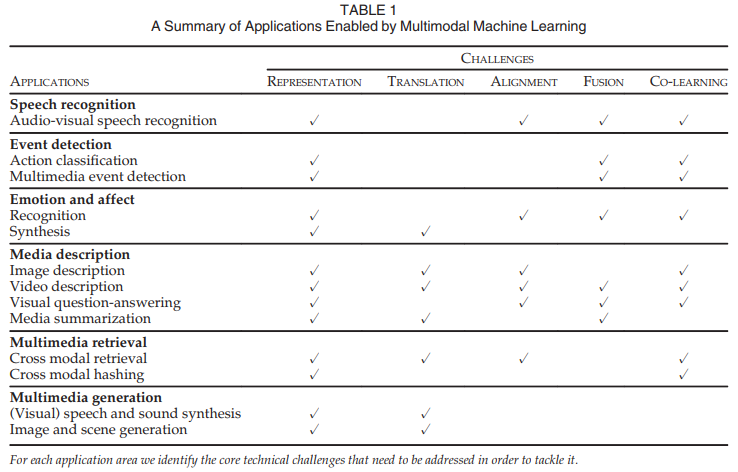
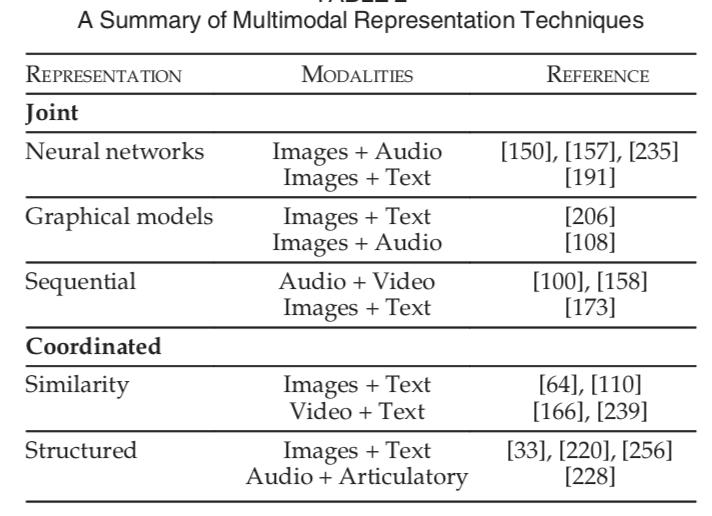
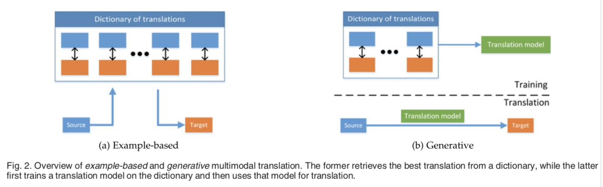
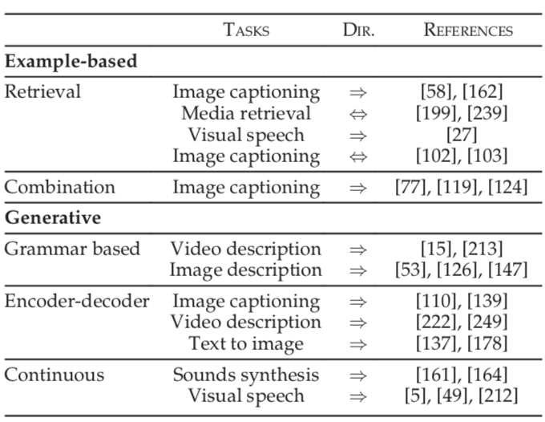
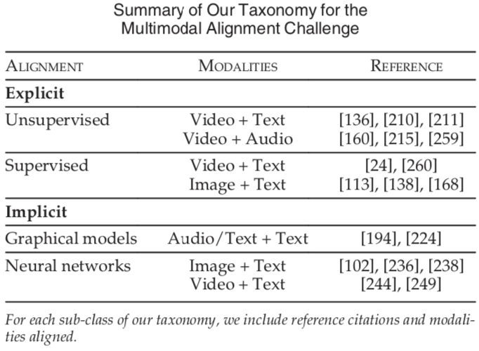
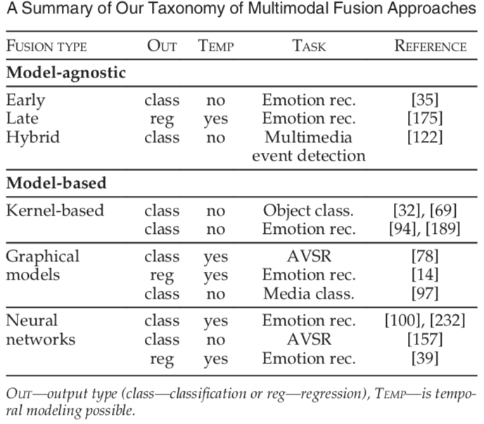
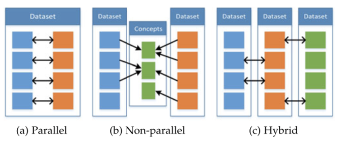
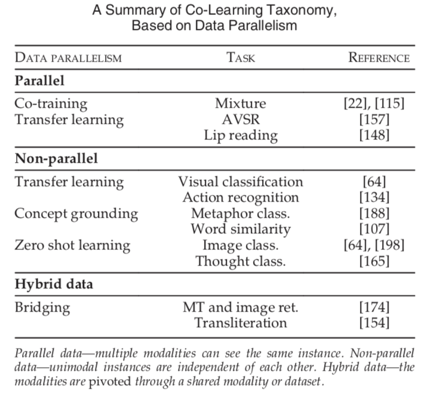

## ReadingNote——Multimodal Machine Learning : A Survey and Taxonomy

>**Multimodal machine learning aims to build models that can process and relate information from multiple modalities.**
**多模态机器学习旨在：建立能够处理和关联来自多个模态的信息的模型。**

Three main modalities: natural languages; visual signals; vocal signals

### I . Challenges
1. Represatation（表征）
>学习怎样以一种利用多模态的互补性和冗余性的方式，表示和汇总多模态数据。多模态数据具有异构性。
2. Translation（翻译）
>怎样将数据从一种模态转换（映射）为另一种模态。除了数据的异构性，模态之间的关系往往是开放或主观的。eg：描述一张图像的正确方法有很多，但是没有一种完美的translation。
3. Alignment（对齐）
>从两种或两种以上的不同模态中，确定（子）要素之间的直接关系。eg：将菜谱中的步骤与显示正在制作的菜肴的视频对齐。为了应对这一挑战，我们需要衡量不同模态之间的相似性，并且处理可能的长期依赖性和模糊性。
4. Fusion（融合）
>融合两个或多个模态的信息来进行预测。eg：对于视听语音识别，将嘴唇运动的视觉描述与语音信号融合来预测说的单词。来自不同模态的信息可能具有不同的预测能力和噪声拓扑，其中至少一种模态可能会有缺失数据。
5. Co-learning（联合学习）
>在模态、模态地表示和模态的预测模型之间传递知识。这一点可以通过co-learning, conceptual grounding和one-shot learning的算法来证明。co-learning探索了怎样利用从一个模态学习的知识，来帮助在不同模态上训练的计算模型。当其中一种模态的资源有限时（如标注数据），这一挑战尤其重要。

### II . Summary of applicatons and the core technical challenges to be addressed

### III . Representation
> we use the term feature and representation interchangeably, with each referring to a vector or tensor representation of an entity, be it an image, audio sample, individual word, or a sentence. **A multimodal representation is a representation of data using information from multiple such entities.** 
以一种计算模型能采用工作的形式表示数据一直是machine learning的一个挑战。 
我们可以互换使用“特征”和“表示”，每个都是一个实体的向量或张量表示，它可以是一张图像，音频样本，单个单词或一个句子。multimodal representation是使用来自多个这样的实体的信息来表示数据的一种表示。 
**表征是一个非常基础的任务，好的表征能极大的提高模型的表现。** 
**利用多模态表示学习到的特征可以用来做信息检索，也可以用于的分类/回归任务。下面列举几个经典的应用。**

**Difficulties :**
1. 数据的异构性，如文字是符号性的，图片是一个RGB矩阵，视频是时序的RGB矩阵，声音的采样结果是一个一位数组。
2. 不同模态产生的噪声的级别不同。
3. 数据的缺失问题。

**Good Properties :**

>以一种比较有意义的方式表示数据的能力，对于多模态问题至关重要，并且是任意模型的骨干。

+ smoothness（平滑）
+ temporal and spatial coherence（时间与空间的一致性）
+ sparsity（稀疏性）
+ natural clustering（自然聚类）
+ similarity in the representation space should reflect the similarity of the corresponding concepts（表示空间的相似性应该反映相应概念的相似性）
+ the representation should be easy to obtain even in the absence of some modalities（即使在某些模态数据缺失的情况下，也应该很容易获得representation）
+ it should be possible to all-in missing modalities given the observed ones（在给定已有的模态的情况下，应该可以确定缺失的模态）

**两种unimodal representation** 
在自然语言处理中，文本特征最初依赖于计算文档中单词出现的次数，但现在多用“利用单词上下文的数据驱动的单词嵌入”（unimodal representation）。 
虽然unimodal representation方面有大量的工作，但直到近期，大多数multimodal representation只是将unimodal ones简单连接在一起，不过这一点正在改变。
+ Joint representations
>将unimodal signals组合到同一个表示空间中，代表方法有神经网络的方法、图模型方法与序列模型方法。 
>主要（但不是唯一）用于：在train和inference步骤中都存在多模态数据的任务。 
>最简单的例子就是：单个模态特征的串联（也称为早期融合）。
+ Coordinated representations
>分别处理unimodal signals，但要对它们增加一定的相似性约束，使它们变成我们想要的协同空间（coordinated space）
>协调方法特征仍在原空间，但是通过相似度或者结构特征协调。

1. **Joint representations将多模态数据映射到公共空间中，更适合于：在推理（inference）过程中，所有模态都存在。广泛应用于：AVSR，情感和多模态手势识别。** 
2. **Coordinated representations将每个模态分别映射到分开的但是协同的空间中，更适合于：在测试时只有一种模态，应用于：multimodal retrieval and representation, grounding, zero shot learning。** 
3. **另外，joint representations用于两种以上模态的情形。coordinated representation大多限制到2种。**

**Representation Taxonomy** 

**(1) neural networks :** 

    一般来说，神经网络由连续的内积，后跟非线性激活函数组成。为了用神经网络来表示数据，首先要对其进行训练，使之能够执行特定的任务（eg：识别图像中的对象）。由于深度神经网络的多层性，假设每个连续层以更抽象的方式表示数据，因此通常使用最后一层或倒数第二层作为数据表示形式。
    为了利用神经网络构造multimodal representation，每个模态从几个单独的神经层开始，然后是一个隐层，将模态映射到一个联合空间中。然后，the joint multimodal representation被送到多个隐藏层中，或直接用来预测。这样的模型可以通过端到端的学习来表示数据并执行特定任务。所以在使用神经网络时，multimodal representation学习和multimodal fusion之间由很密切的联系。
    由于神经网络需要大量标记的训练数据，因此通常使用来自不同，但是相关的领域的无监督数据（eg：自动编码器模型）或监督数据，对此类表示进行训练。
    基于neural network的joint representations的主要优点是：当标记的数据不足以进行监督利用未标记的数据进行学习时，能够利用未标记的数据进行预训练。通常也被用于对现有的特定任务的结果表示进行微调，因为利用无监督数据构建的表示是通用的，并且不一定需要它是最好的。
    其中一个缺点是：不能很自然地处理丢失地数据，尽管有很多方法缓解这个问题。

**(2) probabilistic graphical models :** 

    概率图模型，可以用潜在的随机变量来构造表示。
    DBMs（深度玻尔兹曼机）不需要监督数据来进行训练。由于是图模型，数据的表示是概率的，但是可以将其转换为确定的神经网络，但是这将失去模型的生成方面。
    在单模态数据进行非线性转换后，整合数据，对模型是非常有利的。
    使用多模态DBMs学习multimodal representations的一个很大的优点是：生成性。这一特性使得处理丢失数据的方法更简单，即使丢失了整个模态，模型也能自然的处理。还可以在第二种模态存在的情况下，生成第一种模态的样本，或者从representation中生成两种模态。与自动编码器类似，the representation可以使用未标记的数据进行无监督训练。
    DBMs的主要缺点是：训练难度大——计算成本高；需要使用近似变分训练方法（approximate variational training methods）。

**(3) sequential representation :** 

    我们通常需要表示不同长度的序列，eg: sentences, videos, audio streams。RNNs及其变体LSTM在不同任务的序列建模方面取得了成功。到目前为止，RNN主要用于表示单模态的单词、音频或图像序列，在语言领域取得很大的成功。与传统的神经网络相似，RNN的隐藏态可以看作是数据的一种表示，也就是说，RNN在时间步t处的隐藏态，可以看作是该时间步之前序列的总结

**(4) similarity models :** 

    相似性模型最小化了协同空间中模态之间的距离。eg: 使单词"dog"与dog的图像之间的距离小于单词"dog"和car的图像之间的距离。
    近年来，由于神经网络的学习表示的能力，所以神经网络已经成为一种常用的构造coordinated representations的方法。优势就在于神经网络可以以端到端的方式一起学习coordinated representations。这种coordinated representation的一个例子：DeViSE——一种深层视觉语义嵌入。
    cross-model retrieval和video description任务，通常用：<主语，动词，宾语>，即<subject, verb, object>组合的语言模型和深层视频模型，来在video和sentence之间构造coordinated space。

**(5) structured coordinated space :** 

    上面的模型增强了representations之间的相似性，但structured coordinated space模型超越了这一点，并且增强了模态表示之间额外的约束。增强的结构的类型通常是基于应用的，hashing, cross-modal retrieval, image captioning的约束是不同的。
    structured coordinated spaces通常用于跨模态哈希——将高维数据压缩成紧凑的二进制代码，相似的对象有相似的二进制代码。hashing在结果多模态空间上增强了一定的约束：1）它必须是一个N维Hamming空间——一个具有可控位数的二进制表示。2）不同模态的相同对象必须有相似的hash code。3）空间必须保持相似性。
    structured coordinated representation的另一个例子，来自图像和语言的顺序嵌入。
    structured coordinated space的一个特殊情况：基于典型相关分析（canonical correlation analysis, CCA）,CCA计算线性投影，使两个变量（文中是指模态）之间的相关性最大化，并且增强新空间的正交性。CCA模型已经广泛用于cross-modal retrieval和audiovisual signal analysis。CCA的延伸尝试构造相关最大化非线性映射。
    （还有KCCA，DCCA，略）
    CCA，KCCA，DCCA都是无监督的，仅优化representations之间的相关性，因此捕捉的多是模态间共享的东西。深度典型相关的自动编码器还包括基于自动编码器的数据重建项。这鼓励了representation捕捉模态的特有信息。语义相关最大化方法也支持语义相关性，同时保留相关性最大化和结果空间的正交性，这也促进了CCA和cross-modal hashing技术的结合。

**经典应用** 
1. 在来自 NIPS 2012 的 《Multimodal learning with deep boltzmann machines》一文中提出将 deep boltzmann machines（DBM） 结构扩充到多模态领域，通过 Multimodal DBM，可以学习到多模态的联合概率分布。
2. 协同表示学习一个比较经典且有趣的应用是来自于《Unifying Visual-Semantic Embeddings with Multimodal Neural Language Models 》这篇文章。利用协同学习到的特征向量之间满足加减算数运算这一特性，可以搜索出与给定图片满足“指定的转换语义”的图片。例如：
狗的图片特征向量 - 狗的文本特征向量 + 猫的文本特征向量 = 猫的图片特征向量 -> 在特征向量空间，根据最近邻距离，检索得到猫的图片

### IV . Translation
>实际上也可以理解为映射（mapping）。MML很大一部分研究专注于将一种模态数据翻译（映射）为另一种模态数据。

**Technique Classfication**
+ example-based
>模型在模态之间translating时使用了一个dictionary。 
>从特征字典中找出最佳翻译。基于样本的方法分为基于检索式的和合并的方法。
+ generative
>构造一个model，可以生成translation。 
>通过样本，训练一个翻译模型，并使用翻译模型完成对特征的转换。生成式的方法有基于语法的、encoder-decoder模型和连续模型。

简单的理解：测试阶段，example-based是需要字典的，而生成式是不需要字典的，它通过数据学习到两个模态潜在的映射关系。 
可以说，构造generative模型更具挑战性，因为它要求能够生成信号或符号序列（eg, sentences）。这对于任何模态——visual, acoustic(听觉)，verbal(语言)来说都是困难的，尤其是需要生成时间上和结构上一致的序列时。这使得很多早期的multimodal translation系统依赖于example-based translation。

 

**Difficulties** 
1. open-ended，即未知结束位，例如实时翻译中，在还未得到句尾的情况下，必须实时的对句子进行翻译.
2. 另一个是subjective，即主观评判性，是指很多模态转换问题的效果没有一个比较客观的评判标准，也就是说目标函数的确定是非常主观的。例如，在图片描述中，形成怎样的一段话才算是对图片好的诠释？也许一千个人心中有一千个哈姆雷特吧。非常难于评估，因为这类任务没有标准答案，答案通常非常开放和主观。这其实也是机器翻译面临的问题。 

为了解决评估困难，提出了VQA（Visual question-answering）任务。然而它也有问题，例如特定问题的歧义性，回答和问题偏置(ambiguity of certain questions and answers and question bias)。

**Translation Taxonomy** 

**example-based :** 
* retrieval-based模型：直接使用retrieved translation,并没有对其进行修改。 

      retrieval-based模型可以说是multimodal translation中最简单的形式，它依靠找到dictionary中最近的样本，并将其作为translate的结果，检索可以在单模态空间或中间语义空间（intermediate semantic space）中进行。
      给出一个要translate的单模态实例，单模态检索要在源空间的dictionary中找到最接近的实例。
      这种单模态检索方法的优点：它只需要我们正在检索的单个模态的representation.（The advantage of such unimodal retrieval approches is that they only require the representation of a single modality through which we are performing retrieval.）然而，它通常需要额外的多模态后续处理步骤，比如对retrieved translation进行重新排序，这表明这种方法的一个主要问题：单模态空间的相似性并不总意味着时良好的选择。
      另一种方法是在retrieval过程中，使用中间语义空间来进行相似性比较。
      语义空间中的检索方法往往比单模态检索方法更好，因为它们在一个更具意义的空间检索示例，该空间反映了2中模态，并且通常会对检索进行优化。此外，它也可以进行双向translation，这在单模态方法中并不容易。然而，这需要人为地去构造或学习这样一种语义空间，并且需要有大型训练dictionary（成对样本数据集）。
* combination-based模型：依赖于更复杂的规则，基于大量检索实例来创建translation。 

      使retrieval-based方法更进一步，它不仅仅是从dictionary中检索示例，还会用一种更有意义的方法把这些示例结合起来，来构造更好的translation。基于组合的媒体描述方法是基于：图像的句子描述共享一个可以被利用的公共的、简单的结构。最常见的组合规则是手动的或基于启发式的。

example-based方法存在的问题： 
1. 模型是整个字典，这就会使模型很大，推理起来很慢（不过，hashing之类的方法可以缓解）。
2. 除非任务很简单，或者字典很大，否则，期望与源例相关的、完整的、准确的translation总是存在于字典中是不现实的。（combination模型能构造更复杂的结构，所以能部分解决上述问题，然而它也只能在一个方向上进行translate，不过，semantic space retrieval-based模型可以在两个方向上进行translate.）

**generative :** 
* grammar-based：通常通过使用语法来限制目标域，以简化任务，eg：基于<subject, object, verb>模板来生成受限制的句子。 

      基于语法的模型，根据预定义的语法，来生成特定的模态。首先，从源模态中检测高级概念，比如图像中的对象、视频中的动作。然后，将这些检测到的高级概念，与基于预定义的语法的生成程序，结合到一起，以生成目标模态。
      grammar-based方法的优点是：因为它们使用预定义的模板和限定的语法，所以很可能生成在语法上（对于language）或逻辑上正确的目标实例。缺点：限制了它们，只能生成公式化的而不是创造性的translation。
      此外，grammar-based方法依赖于更复杂的pipline来进行概念检测，每个概念都需要一个单独的model和一个单独的训练集。

* encoder-decoder：首先将源模态编码成潜在表示，然后送到解码器中，生成目标模态。 

      基于端到端训练的神经网络的编码器-解码器模型是目前最流行的multimodal translation技术之一。这种模型背后的主要思想：首先，将源模态编码为向量表示，然后，用解码器生成目标模态，所有这些都是在单过程pipline进行的。
      使用RNN生成translation面临的问题：模型必须从图像、句子或视频的单个向量representation中生成描述。这在生成长序列时，尤其困难，因为模型可能会忘记初始输入。通过在解码过程中的每一步，包含进编码信息，可以部分解决这个问题。还提出了注意力模型，使生成期间，解码器能更好的聚焦于图像、句子或视频的某些部分。
      最近，在使用生成对抗网络生成图像方面取得了很大的进展，该网络已被用作RNN的替代方案，用于“从文本生成图像”。

* continuous generation：基于源模态输入流，连续生成目标模态；最适合在时间序列之间translate. eg：文本到语音（text-to-speech）。 

      用于序列translation,以在线的方式，在每个时间步都生成输出。当从一个序列translate到另一个序列时（eg：text to speech, speech to text, video to text），这些模型很有用。
      针对这类模型提出的不同技术： graphical modals, continuous encoder-decoder approaches，以及其他回归或分类技术。
      这列模型需要解决的额外的困难：模态间时间一致性的需求。
      早期，许多工作使用图模型来在连续信号之间进行multimodal translation，然而这些方法正在被基于神经网络编码器-解码器的技术所取代。

**经典应用** 
1. 机器翻译（Machine Translation）：将输入的语言A（即时）翻译为另一种语言B。类似的还有唇读（Lip Reading）和语音翻译 （Speech Translation），分别将唇部视觉和语音信息转换为文本信息。
2. 图片描述（Image captioning) 或者视频描述（Video captioning)： 对给定的图片/视频形成一段文字描述，以表达图片/视频的内容。
3. 语音合成（Speech Synthesis）：根据输入的文本信息，自动合成一段语音信号。

### V . Alignment

>从两个甚至多个模态中寻找事物子成份之间的关系和联系。对齐可以是空间维度的，比如图片语义分割，给定一张图片和图片的描述，找到图中的某个区域以及这个区域在描述中对应的表述。也可以是时间维度的，比如给定一个美食制作视频和对应的菜谱，实现菜谱中的步骤描述与视频分段的对应。

对齐分为两类：**显式对齐和隐式对齐**。显式对齐即应用的主要任务就是对齐，而隐式对齐是指应用在完成主要任务时需要用到对齐的技术。

**技术方法分类**
1. 显示对齐：Unsupervised；(Weakly)Supervised
2. 隐式对齐：Graphical models；Neural networks（attention机制）

**Difficulties**
1. 很少有显式对齐标注的数据集
2. 不同模态之间相似度的计算难以建模
3. 存在多个可能的对齐方案，此外不是一个模态的所有元素在另一个模态中都存在对应

**Alignment Taxonomy** 

### VI . Fusion
>多模态融合指从多个模态信息中整合信息来完成分类或回归任务。“multimodal fusion is the concept of integrating information from multiple modalities with the goal of predicting an outcome measure: a class (e.g., happy vs. sad) through classi?cation, or a continuous value (e.g., positivity of sentiment) through regression.”即是负责联合多个模态的信息，进行目标预测（分类或者回归） 
>融合还有更宽泛的定义，而综述中定义的融合，是指任务在最后预测并以预测输出值为目的时才进行多模态融合。在深度神经网络方法下，融合和表征两个任务是很难区分的。但在图模型以及基于核的方法中比较好区分。 
>多模态特征融合是指将从不同模态的特征集成在一起，共同完成一个任务，如分类。

**Significances** 
1. 在观察同一个现象时引入多个模态，可能带来更robust的预测
2. 接触多个模态的信息，可能让我们捕捉到互补的信息（complementary information），尤其是这些信息在单模态下并不“可见”时。
3. 一个多模态系统在缺失某一个模态时依旧能工作

多模态融合有两大类：**无模型model-agnostic**；**基于模型model-based**
>**model-agnostic**：不直接依赖于某个特定的机器学习算法
+ **early fusion** 也称为feature-based，是基于特征的。通常是在提取各模态特征后就进行融合，一般只是简单地连接他们的表征，即joint representation。并使用融合后的数据进行模型训练，相比之后两种在训练上更为简单。
+ **late fusion** 也称为decision-based，是基于决策的。该方法在各个模态做出决策后才进行融合，得出最终的决策。常见的机制有平均（averaging）、投票（voting schemes）等等。这种方法中，各模态可以使用不同的模型来训练，带来更多的便利性。
+ **hybrid fusion** 一种尝试结合early fusion和late fusion优势的方法。

>**model-based**：显式得在构造中完成融合
+ **Multiple Kernel Learning** 多核学习
+ **Graphical models** 图模型
+ **Neural Networks** 神经网络
+ 神经网络在近期成为解决融合问题非常流行的方案，然而图模型以及多核学习依旧被使用，尤其是在有限的训练数据和模型可解释性非常重要的情况下。

**Difficulties** 
多模态融合研究的难点主要包括如何判断每个模态的置信水平、如何判断模态间的相关性、如何对多模态的特征信息进行降维以及如何对非同步采集的多模态数据进行配准等。
1. 信号可能并不是时序对齐的（temporally aligned）。很可能是密集的连续信号和稀疏的事件（比如一大段视频只对应一个词，然后整个视频只对应稀少的几个词）。
2. it is difficult to build models that exploit supplementary and not only complementary information
3. 每一个模态在不同的时间点可能表现出不同的形式和不同等级的噪声

**Fusion Taxonomy** 

**经典应用** 
1. 视觉-音频识别（Visual-Audio Recognition）： 综合源自同一个实例的视频信息和音频信息，进行识别工作。
2. 多模态情感分析（Multimodal sentiment analysis）： 综合利用多个模态的数据（例如下图中的文字、面部表情、声音），通过互补，消除歧义和不确定性，得到更加准确的情感类型判断结果。
3. 手机身份认证（Mobile Identity Authentication）： 综合利用手机的多传感器信息，认证手机使用者是否是注册用户。

### VII . Co-Learning
>* 联合学习的目的是通过利用资源丰富（比如数据量大）的模态的知识来辅助资源稀缺（比如较小数据）的模态建立模型。比如迁移学习（Transfer Learning）就是属于这个范畴，绝大多数迈入深度学习的初学者尝试做的一项工作就是将 ImageNet 数据集上学习到的权重，在自己的目标数据集上进行微调。
* 联合学习 is task independent and could be used to create better fusion, translation, and alignment models.
* 联合学习中，辅助模态（helper modality）通常只参与模型的训练过程，并不参与模型的测试使用过程。即使用时，模型输入并不需要辅助模态的数据。

**联合学习的分类是基于训练资源（数据）形式划分的** 
 
**parallel** modalities are from the same dataset and there is a direct correspondence between instances; 
**non-parallel** modalities are from different datasets and do not have overlapping instances, but overlap in general categories or concepts;
**hybrid** the instances or concepts are bridged by a third modality or a dataset.

**Co-Learning Taxonomy** 

